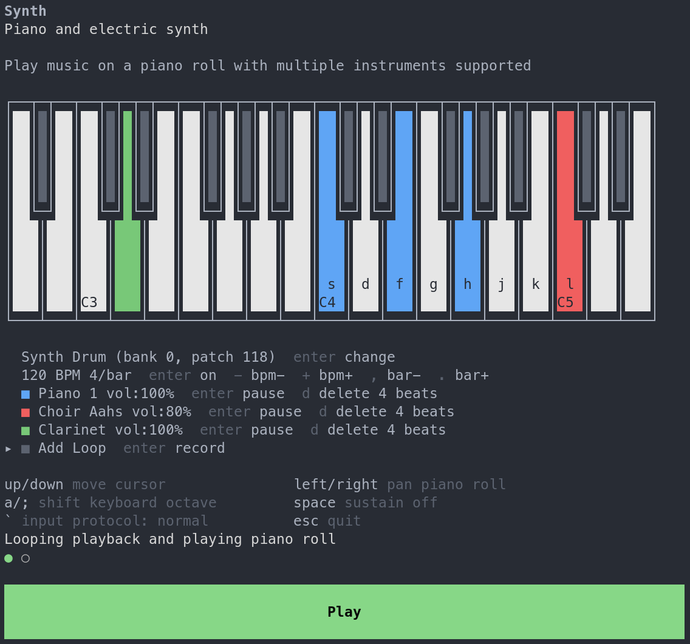

# Terminal Synth

[](https://terminalgames.net?args=synth)

Play with the following command:

```
ssh -q terminalgames.net -t audio synth 2>| ffplay -f ogg -nodisp -v quiet -autoexit -af "adelay=20|20" -
```

## Development

Run it with the following commands:

```
cargo build --target wasm32-wasip1 --release
```

```
terminal-games-cli ./target/wasm32-wasip1/release/synth.wasm
```

Download the CLI from the main [Terminal Games repository](https://github.com/terminal-games/terminal-games)

## License

The soundfont file `TimGM6mb.sf2` is from https://musescore.org/en/handbook/3/soundfonts-and-sfz-files "The free default soundfont that comes with MuseScore 1" and licensed under the GNU GPL, version 2.

The code is also licensed under the GPLv2.
